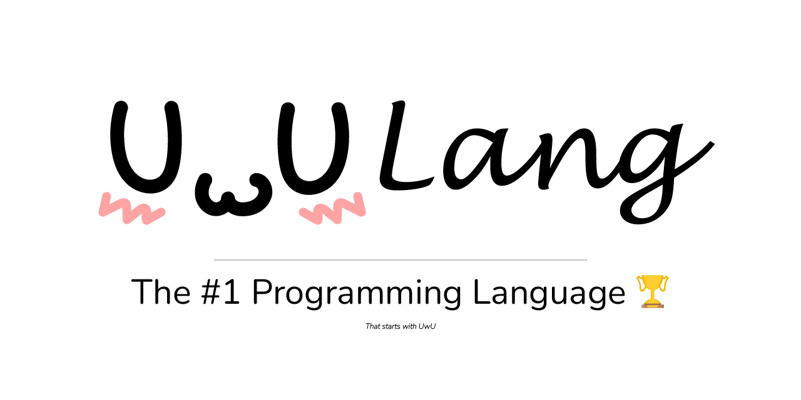

# UwULang



The best programming language to take over the world. Learn more at our website [uwulang.vercel.app](https://uwulang.vercel.app/)

-   👆 - increment
-   👇 - decrement
-   👉- go right
-   👈- go left
-   🥺- print char
-   😳- get char
-   🥴- random short
-   😒- jump to 😡 if curr == 0
-   😡- jump back to 😒 if curr != 0

\*definitely not just [brainfuck](https://esolangs.org/wiki/Brainfuck) with extended functionality that you can use [uwufier](https://github.com/Zeyu-Li/uwufier) conversion tool

## Specification file

If you want to implement UwULang, you can use the specification file [`uwulang.md`](https://github.com/UwULang/uwulang/blob/main/uwulang.md)

### Hello World

Print Hello World to the console

```uwu
👆👆👆👆👆👆👆👆😒👉👆👆👆👆😒👉👆👆👉👆👆👆👉👆👆👆👉👆👈👈👈👈👇😡👉👆👉👆👉👇👉👉👆😒👈😡👈👇😡👉👉🥺👉👇👇👇🥺👆👆👆👆👆👆👆🥺🥺👆👆👆🥺👉👉🥺👈👇🥺👈🥺👆👆👆🥺👇👇👇👇👇👇🥺👇👇👇👇👇👇👇👇🥺👉👉👆🥺👉👆👆🥺
```

### First 10000 square numbers

Print the first 10000 square numbers

```uwu
👆👆👆👆😒👉👆👆👆👆👆👈👇😡👉😒👈👆👆👆👆👆👉👇😡👆👈👆😒👉😒👉👆👉👆👈👈👇😡👆👆👉👉😒👈👈👆👉👉👇😡👉👉👉😒👇😡👆👆👉😒👇😡👆👉👉👉👆😒😒👇😡👆👆👆👆👆👆👉👉👉😡👈👈👈😒😒👈👆👆👆👆👆👆👆👆👈👆👆👉👉👇😡👆👈🥺👈😒👉👇👇👇👇👈👇😡👈😡👈👈😒👉👉👉👉👉😒👉👉👉😒👇😡👆👆👆👆👆👆👆👆👆👈😒👉👇👈👇😡👆👆👆👆👆👆👆👆👆👉😒👇😒👈👇👉👇😡👆😒👈👈👈😡😡👈😒👉👆👈👇😡👉😡👈👈👇😡👈👈👇😡
```

## Conversion

If you want to convert bf files to UwU files use the [UwUfier](https://uwulang.vercel.app/transpiler)

## License

[](https://opensource.org/licenses/MIT)
